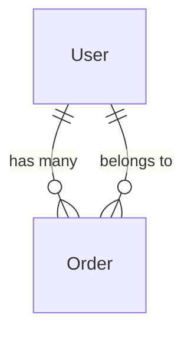

# Project Context

> [!IMPORTANT]
> This document provides context about the existing project structure.
> PM must read this before defining new requirements.
> **Last Updated**: YYYY-MM-DD

---

## 1. Database Schema (Prisma)

### Existing Tables

#### User
```prisma
model User {
  id        String   @id @default(uuid())
  email     String   @unique
  name      String?
  role      String   @default("USER")
  createdAt DateTime @default(now())
  updatedAt DateTime @updatedAt
}
```


### Table Relationships


---

## 2. Shared Schemas (packages/shared-schema)

### Existing Zod Schemas

```typescript
// packages/shared-schema/src/user.ts
import { z } from 'zod';
export const UserSchema = z.object({ id: z.string() });

```

---

## 3. Existing API Endpoints

### User APIs
| Method | Endpoint | Description | Status |
|--------|----------|-------------|--------|
| GET | `/api/users/:id` | Get user by ID | ✅ Active |
| POST | `/api/users` | Create new user | ✅ Active |
| PATCH | `/api/users/:id` | Update user | ✅ Active |
| DELETE | `/api/users/:id` | Delete user | ✅ Active |

### Order APIs
| Method | Endpoint | Description | Status |
|--------|----------|-------------|--------|
| GET | `/api/orders` | List orders | ✅ Active |
| GET | `/api/orders/:id` | Get order by ID | ✅ Active |
| POST | `/api/orders` | Create order | ✅ Active |
| PATCH | `/api/orders/:id/status` | Update order status | ✅ Active |

### Product APIs
| Method | Endpoint | Description | Status |
|--------|----------|-------------|--------|
| GET | `/api/products` | List products | ✅ Active |
| GET | `/api/products/:id` | Get product by ID | ✅ Active |
| POST | `/api/products` | Create product | ✅ Active |

---

## 4. Frontend Components (Existing)

### Atoms
- `Button` - Primary, Secondary, Outline variants
- `Input` - Text, Email, Password types
- `Badge` - Status indicators

### Molecules
- `SearchInput` - Input with search icon
- `UserAvatar` - Avatar with fallback

### Organisms
- `Header` - Navigation header
- `DataTable` - Sortable, paginated table

---

## 5. Design Tokens (if Tailwind configured)

```javascript
// tailwind.config.ts
colors: {
  primary: '#3B82F6',
  secondary: '#10B981',
  background: '#F9FAFB',
  text: {
    primary: '#111827',
    secondary: '#6B7280',
  }
}
```

---

## 6. Tech Stack Reference

| Layer | Technology |
|-------|------------|
| Frontend | Next.js 14, React 18, TailwindCSS |
| Backend | Node.js, Express/NestJS |
| Database | PostgreSQL, Prisma ORM |
| Validation | Zod |
| State | TanStack Query, Zustand |
| Testing | Vitest, React Testing Library |

---

## 7. How to Update This Document

When adding new features:
1. After Architect defines new schemas → Update Section 2
2. After Developer implements APIs → Update Section 3
3. After Developer adds components → Update Section 4
4. After adding new tables → Update Section 1

> [!TIP]
> Run this to see current Prisma schema:
> ```bash
> cat prisma/schema.prisma
> ```
