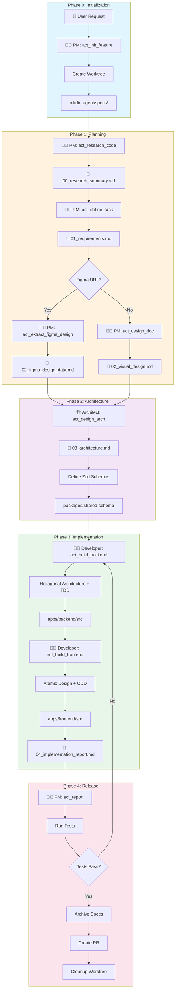

# 🔄 AI Agency Workflow Overview

> **Purpose**: This document is the **Single Source of Truth** for the entire development workflow.  
> All agents MUST reference this before starting any task.

---

## 📊 Workflow Diagram



---

## 📁 Document Output Specification

All documents are created in **`.agent/specs/`** within the active worktree.

| File | Creator | Description |
|------|---------|-------------|
| `00_research_summary.md` | PM | Codebase research: reusable tables, APIs, components |
| `01_requirements.md` | PM | User stories, acceptance criteria, constraints |
| `02_figma_design_data.md` | PM | Figma MCP extracted design tokens & components |
| `02_visual_design.md` | PM | Manual wireframes (if no Figma) |
| `03_architecture.md` | Architect | Zod schemas, API spec, implementation plan |
| `04_implementation_report.md` | Developer | Test results, screenshots, commit history |

---

## 🎭 Role Responsibilities

### 🧑‍💼 Product Manager (PM)
- **Phase 0**: Initialize worktree (`act_init_feature`)
- **Phase 1**: Research + Requirements + Design extraction
- **Phase 4**: Final verification and PR creation

### 🏗️ Lead Architect
- **Phase 2**: Technical design and schema definition
- Creates the "Contract" between Backend and Frontend

### 👨‍💻 Full Stack Developer
- **Phase 3**: Backend (Hexagonal) + Frontend (Atomic Design)
- Writes tests FIRST (TDD/CDD)

### 👔 Team Lead (Orchestrator)
- Reviews ALL outputs before phase transitions
- Sends work back if quality < 100%
- Does NOT write code or research

---

## 🚦 Quality Gates

Each phase transition requires approval:

```
PM Output → [Lead Review] → Architect Input
Architect Output → [Lead Review] → Developer Input
Developer Output → [Lead Review] → PM Finalization
```

> ⚠️ **STOP THE LINE**: If a document is missing or incomplete, do NOT proceed.

---

## 📂 Directory Structure

```
📁 .worktrees/<feature-name>/
├── 📁 .agent/
│   └── 📁 specs/          ← ALL DOCUMENTS GO HERE
│       ├── 00_research_summary.md
│       ├── 01_requirements.md
│       ├── 02_figma_design_data.md
│       ├── 03_architecture.md
│       └── 04_implementation_report.md
├── 📁 my-100x-project/
│   ├── 📁 apps/
│   │   ├── backend/
│   │   └── frontend/
│   └── 📁 packages/
│       └── shared-schema/
└── .git (worktree link)
```

---

## ✅ Checklist for Agents

Before starting work, verify:

- [ ] Am I in the correct worktree? (`pwd`)
- [ ] Does `.agent/specs/` exist?
- [ ] Are all prerequisite documents present?
- [ ] Did I read the previous phase's output?

After completing work:

- [ ] Did I save my output to `.agent/specs/`?
- [ ] Did I commit my changes?
- [ ] Did I notify the next agent/Lead?
