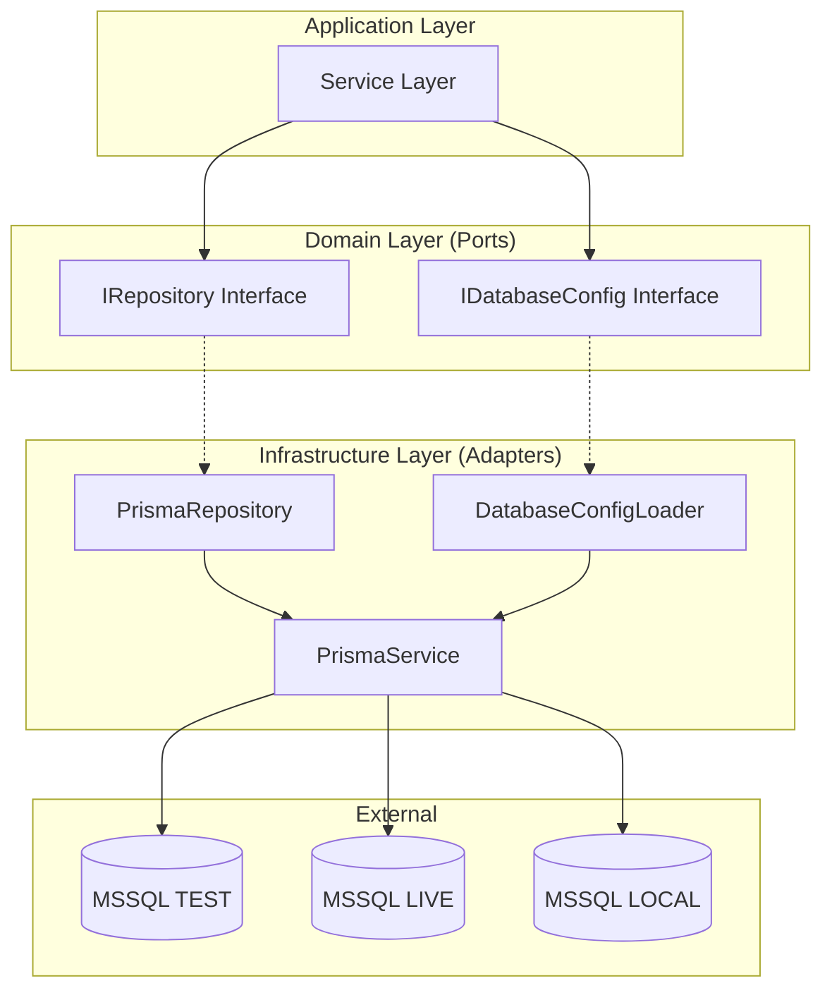

# Architecture: ORM-MSSQL2 (Portable ORM Layer)

> **Feature**: `orm-mssql2`  
> **Author**: Lead Architect  
> **Date**: 2025-12-12  
> **Status**: Ready for Implementation

---

## 1. Architecture Overview

이식성(Portability)을 최우선으로 하는 **3-Layer Abstraction** 아키텍처를 제안합니다.



---

## 2. Portability Strategy

### 2.1 Abstraction Levels

| Level | Description | Trade-off |
|-------|-------------|-----------|
| **Level 1: ORM Abstraction** | Repository 인터페이스로 Prisma 추상화 | 간단, Prisma 의존 |
| **Level 2: Connection Abstraction** | 환경별 연결 문자열 동적 교체 | 중간 복잡도 |
| **Level 3: Full Vendor Independence** | 완전한 DB 벤더 독립 (TypeORM 등 교체 가능) | 복잡, 높은 유연성 |

> [!IMPORTANT]
> **선택된 전략: Level 1 + Level 2**
> 
> - Prisma를 그대로 사용하되, Repository 인터페이스로 추상화
> - 환경 설정 시스템으로 TEST/LIVE/LOCAL 동적 전환
> - 향후 DB 벤더 변경 시 Adapter만 교체하면 됨

### 2.2 Why This Approach?

1. **실용적**: Prisma의 강점(Type Safety, Auto-completion)을 유지
2. **테스트 용이**: Mock Repository로 Unit Test 가능
3. **점진적 마이그레이션**: 나중에 TypeORM 등으로 전환 시 Adapter만 구현

---

## 3. Directory Structure

```
apps/backend/
├── src/
│   ├── config/                          # [NEW] 환경 설정
│   │   ├── database.config.ts           # DB 환경 설정 로더
│   │   ├── database.config.interface.ts # Port: IDatabaseConfig
│   │   └── index.ts
│   │
│   ├── prisma/                          # [MODIFY] Prisma 서비스
│   │   ├── prisma.module.ts
│   │   └── prisma.service.ts            # DatabaseConfig 주입받아 동적 연결
│   │
│   ├── shared/
│   │   └── domain/                      # [NEW] 공통 도메인 인터페이스
│   │       ├── base.repository.ts       # 제네릭 IRepository<T>
│   │       └── index.ts
│   │
│   └── [feature]/                       # 각 피처별 구조
│       ├── domain/
│       │   ├── [entity].model.ts
│       │   └── [entity].repository.ts   # Port: extends IRepository
│       └── infrastructure/
│           └── prisma-[entity].repository.ts  # Adapter
│
├── prisma/
│   └── schema.prisma                    # [REPLACE] MSSQL provider로 교체
│
└── .env                                 # [UPDATE] MSSQL 연결 문자열
```

---

## 4. The Contract (Interfaces & Types)

### 4.1 Database Environment Type

```typescript
// config/database.config.interface.ts

export type DatabaseEnvironment = 'TEST' | 'LIVE' | 'LOCAL';

export interface IDatabaseConfig {
  readonly environment: DatabaseEnvironment;
  readonly connectionUrl: string;
}

export const DATABASE_CONFIG = Symbol('DATABASE_CONFIG');
```

### 4.2 Database Configuration Loader

```typescript
// config/database.config.ts

import { Injectable } from '@nestjs/common';
import { IDatabaseConfig, DatabaseEnvironment } from './database.config.interface';

@Injectable()
export class DatabaseConfigLoader implements IDatabaseConfig {
  private readonly _environment: DatabaseEnvironment;
  private readonly _connectionUrl: string;

  constructor() {
    // 1. 환경변수에서 DB_ENV 읽기 (기본값: TEST)
    const env = (process.env.DB_ENV || 'TEST') as DatabaseEnvironment;
    this._environment = env;

    // 2. 환경에 맞는 URL 선택
    const urlMap: Record<DatabaseEnvironment, string | undefined> = {
      TEST: process.env.MSSQL_TEST_URL,
      LIVE: process.env.MSSQL_LIVE_URL,
      LOCAL: process.env.MSSQL_LOCAL_URL,
    };

    const url = urlMap[env];
    if (!url) {
      throw new Error(`Missing database URL for environment: ${env}`);
    }
    this._connectionUrl = url;
  }

  get environment(): DatabaseEnvironment {
    return this._environment;
  }

  get connectionUrl(): string {
    return this._connectionUrl;
  }
}
```

### 4.3 Generic Repository Interface (Port)

```typescript
// shared/domain/base.repository.ts

export interface IRepository<T, ID = string> {
  findById(id: ID): Promise<T | null>;
  findAll(): Promise<T[]>;
  create(entity: Partial<T>): Promise<T>;
  update(id: ID, entity: Partial<T>): Promise<T>;
  delete(id: ID): Promise<void>;
}
```

### 4.4 Feature-Specific Repository (Port)

```typescript
// users/domain/user.repository.ts

import { IRepository } from '../../shared/domain/base.repository';
import { User } from './user.model';

export interface IUserRepository extends IRepository<User> {
  findByEmail(email: string): Promise<User | null>;
  // 추가 도메인 특화 메서드
}

export const USER_REPOSITORY = Symbol('USER_REPOSITORY');
```

---

## 5. Prisma Configuration

### 5.1 Schema (MSSQL Provider)

```prisma
// prisma/schema.prisma

datasource db {
  provider = "sqlserver"
  url      = env("DATABASE_URL")
}

generator client {
  provider = "prisma-client-js"
}

// 아래 모델들은 `prisma db pull`로 자동 생성됨
// TEST DB의 모든 테이블이 여기에 반영됩니다
```

### 5.2 Environment Variables

```dotenv
# .env

# ============================================
# Database Environment Selection
# Options: TEST | LIVE | LOCAL
# ============================================
DB_ENV=TEST

# ============================================
# MSSQL Connection Strings
# ============================================
MSSQL_TEST_URL="sqlserver://fitpluskr-test-dbserver.database.windows.net:1433;database=fitplusKR_test_database;user=inbodyfit;password=fitplus0418!;encrypt=true;trustServerCertificate=false;connectionTimeout=60"
MSSQL_LIVE_URL="sqlserver://fitpluskr-live-dbserver.database.windows.net:1433;database=fitplusKR_live_database;user=inbodyfit;password=fitplus0418!;encrypt=true;trustServerCertificate=false;connectionTimeout=60"
MSSQL_LOCAL_URL="sqlserver://localhost:1433;database=local_db;user=sa;password=YourLocalPassword;encrypt=false"

# ============================================
# Prisma uses this (Dynamic based on DB_ENV)
# ============================================
DATABASE_URL="${MSSQL_TEST_URL}"
```

> [!WARNING]
> `.env` 파일은 `.gitignore`에 반드시 포함해야 합니다!

### 5.3 Dynamic URL Selection (Alternative)

Prisma는 `DATABASE_URL` 환경변수를 사용합니다. 런타임에 동적으로 전환하려면:

```typescript
// prisma/prisma.service.ts

import { Injectable, OnModuleInit, Inject } from '@nestjs/common';
import { PrismaClient } from '@prisma/client';
import { DATABASE_CONFIG, IDatabaseConfig } from '../config/database.config.interface';

@Injectable()
export class PrismaService extends PrismaClient implements OnModuleInit {
  constructor(
    @Inject(DATABASE_CONFIG) private readonly dbConfig: IDatabaseConfig
  ) {
    super({
      datasources: {
        db: {
          url: dbConfig.connectionUrl,
        },
      },
    });
  }

  async onModuleInit() {
    console.log(`[PrismaService] Connecting to ${this.dbConfig.environment} database...`);
    await this.$connect();
    console.log(`[PrismaService] Connected successfully!`);
  }

  async onModuleDestroy() {
    await this.$disconnect();
  }
}
```

---

## 6. Module Configuration

### 6.1 Config Module

```typescript
// config/config.module.ts

import { Global, Module } from '@nestjs/common';
import { DatabaseConfigLoader } from './database.config';
import { DATABASE_CONFIG } from './database.config.interface';

@Global()
@Module({
  providers: [
    {
      provide: DATABASE_CONFIG,
      useClass: DatabaseConfigLoader,
    },
  ],
  exports: [DATABASE_CONFIG],
})
export class ConfigModule {}
```

### 6.2 Updated Prisma Module

```typescript
// prisma/prisma.module.ts

import { Global, Module } from '@nestjs/common';
import { PrismaService } from './prisma.service';

@Global()
@Module({
  providers: [PrismaService],
  exports: [PrismaService],
})
export class PrismaModule {}
```

### 6.3 App Module

```typescript
// app.module.ts

import { Module } from '@nestjs/common';
import { ConfigModule } from './config/config.module';
import { PrismaModule } from './prisma/prisma.module';
import { UsersModule } from './users/users.module';

@Module({
  imports: [
    ConfigModule,  // 먼저 로드
    PrismaModule,
    UsersModule,
  ],
})
export class AppModule {}
```

---

## 7. Adapter Implementation Pattern

### 7.1 Prisma Repository (Adapter)

```typescript
// users/infrastructure/prisma-user.repository.ts

import { Injectable } from '@nestjs/common';
import { IUserRepository } from '../domain/user.repository';
import { User } from '../domain/user.model';
import { PrismaService } from '../../prisma/prisma.service';

@Injectable()
export class PrismaUserRepository implements IUserRepository {
  constructor(private readonly prisma: PrismaService) {}

  async findById(id: string): Promise<User | null> {
    return this.prisma.user.findUnique({ where: { id } });
  }

  async findByEmail(email: string): Promise<User | null> {
    return this.prisma.user.findUnique({ where: { email } });
  }

  async findAll(): Promise<User[]> {
    return this.prisma.user.findMany();
  }

  async create(data: Partial<User>): Promise<User> {
    return this.prisma.user.create({ data: data as any });
  }

  async update(id: string, data: Partial<User>): Promise<User> {
    return this.prisma.user.update({ where: { id }, data });
  }

  async delete(id: string): Promise<void> {
    await this.prisma.user.delete({ where: { id } });
  }
}
```

### 7.2 Module DI Configuration

```typescript
// users/users.module.ts

import { Module } from '@nestjs/common';
import { UsersController } from './users.controller';
import { UsersService } from './users.service';
import { PrismaUserRepository } from './infrastructure/prisma-user.repository';
import { USER_REPOSITORY } from './domain/user.repository';

@Module({
  controllers: [UsersController],
  providers: [
    UsersService,
    {
      provide: USER_REPOSITORY,
      useClass: PrismaUserRepository,
    },
  ],
})
export class UsersModule {}
```

---

## 8. Testing Strategy

### 8.1 Integration Test (Real DB)

```typescript
// test/integration/users.integration.spec.ts

describe('Users Integration Test (TEST DB)', () => {
  // DB_ENV=TEST 환경에서 실제 fitpluskr-test-dbserver에 연결
  
  beforeAll(async () => {
    process.env.DB_ENV = 'TEST';
    // NestJS TestingModule 생성
  });

  it('should connect to TEST database', async () => {
    // 실제 쿼리 테스트
  });
});
```

### 8.2 Unit Test (Mocked)

```typescript
// users/users.service.spec.ts

describe('UsersService (Unit)', () => {
  let service: UsersService;
  let mockRepository: jest.Mocked<IUserRepository>;

  beforeEach(() => {
    mockRepository = {
      findById: jest.fn(),
      findByEmail: jest.fn(),
      findAll: jest.fn(),
      create: jest.fn(),
      update: jest.fn(),
      delete: jest.fn(),
    };

    // Repository Mock 주입
  });

  it('should find user by id', async () => {
    mockRepository.findById.mockResolvedValue({ id: '1', name: 'Test' });
    const result = await service.findById('1');
    expect(result).toEqual({ id: '1', name: 'Test' });
  });
});
```

---

## 9. Atomic Task List (For Developer)

### Phase 1: Environment Setup
1. [ ] `.env` 파일에 MSSQL 연결 문자열 추가
2. [ ] `.gitignore`에 `.env` 확인
3. [ ] `prisma/schema.prisma` provider를 `sqlserver`로 변경
4. [ ] `prisma db pull` 실행하여 TEST DB 스키마 introspection
5. [ ] `npx prisma generate` 실행

### Phase 2: Configuration System
6. [ ] `src/config/database.config.interface.ts` 생성
7. [ ] `src/config/database.config.ts` 생성
8. [ ] `src/config/config.module.ts` 생성
9. [ ] `src/config/index.ts` 생성

### Phase 3: Prisma Service Update
10. [ ] `src/prisma/prisma.service.ts` 수정 (DatabaseConfig 주입)
11. [ ] `src/prisma/prisma.module.ts` 수정

### Phase 4: Domain Layer (Ports)
12. [ ] `src/shared/domain/base.repository.ts` 생성
13. [ ] 각 Entity별 Repository 인터페이스 업데이트

### Phase 5: Infrastructure Layer (Adapters)
14. [ ] 각 Entity별 PrismaRepository 구현 업데이트
15. [ ] Module DI 설정 업데이트

### Phase 6: Verification
16. [ ] `npm run dev` 실행하여 DB 연결 확인
17. [ ] 통합 테스트 실행 (TEST DB)
18. [ ] `DB_ENV=LIVE` 변경 후 연결 확인 (Optional)

---

## 10. Handoff to Developer

> [!IMPORTANT]
> ### 🔗 Next Step: `/03_full_stack_developer`
> 
> 위 Task List를 순서대로 구현하세요.
> 
> **핵심 체크포인트**:
> 1. `prisma db pull` 후 스키마가 정상적으로 생성되는지 확인
> 2. `DB_ENV` 변경만으로 환경 전환이 되는지 확인
> 3. Repository 인터페이스가 Service에서 올바르게 주입되는지 확인

---

*Document generated by Lead Architect Agent*
